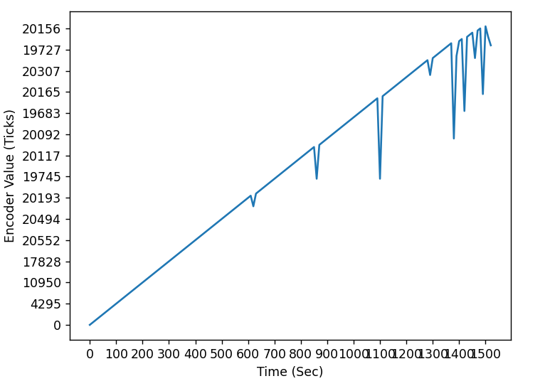
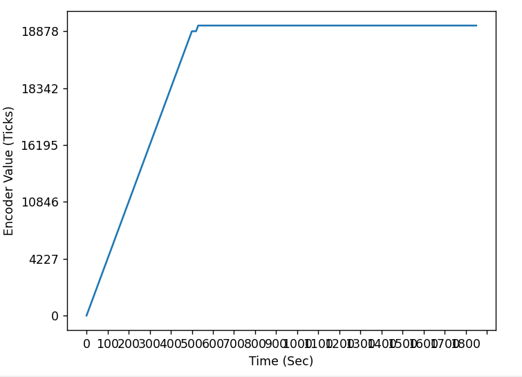
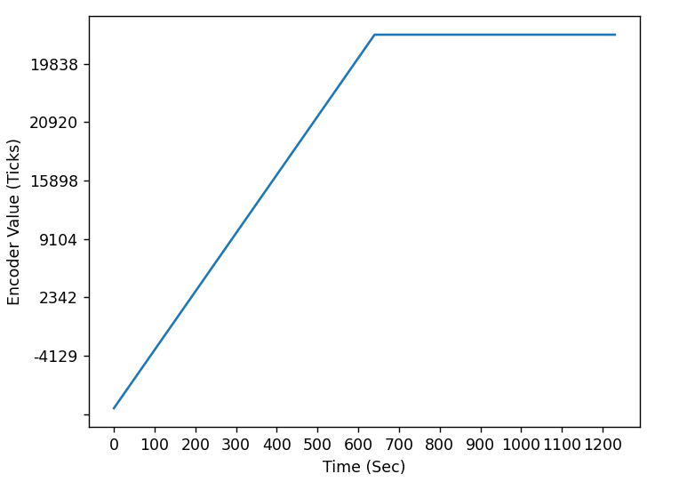

# me405_lab2
## Description:
This repository is for Lab 2 in the ME-405 class to test a closed loop controller using a step response test.
Please install all the files in src onto the MicroPython Board except for pc_com.py.
Run main.py on the MicroPython Board and then pc_com.py on the PC to connect the communication and data.
*May need to adjust the COMS port number in the pc_com.py file*

### Closed Loop Controller
The closed loop controller utilizes only a P gain called Kp which can be set by a function within the controller task.
The controller also takes in a desired position for the motor through another function.
Using encoder feedback the controller subtracts its desired position with the current position of the motor to produce the positional error.
The positional error is then multiplied by the Kp gain outputted as a PWM value for the motor.

### Step Response Test System
The step response test system uses utime to record the time everytime the controller produces a PWM output and record the output as well.
This data is then appended to a list of positonal data, which then used to produce graphs of the results.
Below are the test result of the different Kp Gains Tested with the target position being 20000 ticks.
*Typo with the time units. They are in ms not sec*

We began with testing a large gain, but due to the high oscillations we dialed the gain down for second trial.

Figure 1. Kp Gain = 1

The second and third trial we tried the same gain twice to see a slower ramp up so for the last trial, so we raised the gain a little.

Figure 2. Kp Gain = 0.01

.png)

Figure 3. Kp Gain = 0.01

The 0.1 Kp Gain produced the quickest and most stable results as seem in Figure 4.

Figure 4. Kp Gain = 0.1
